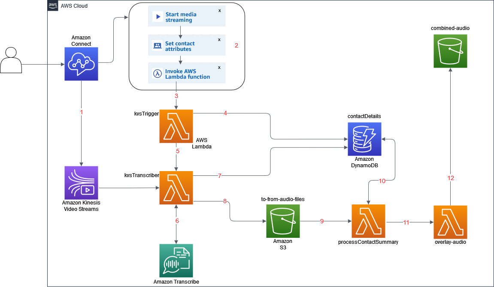
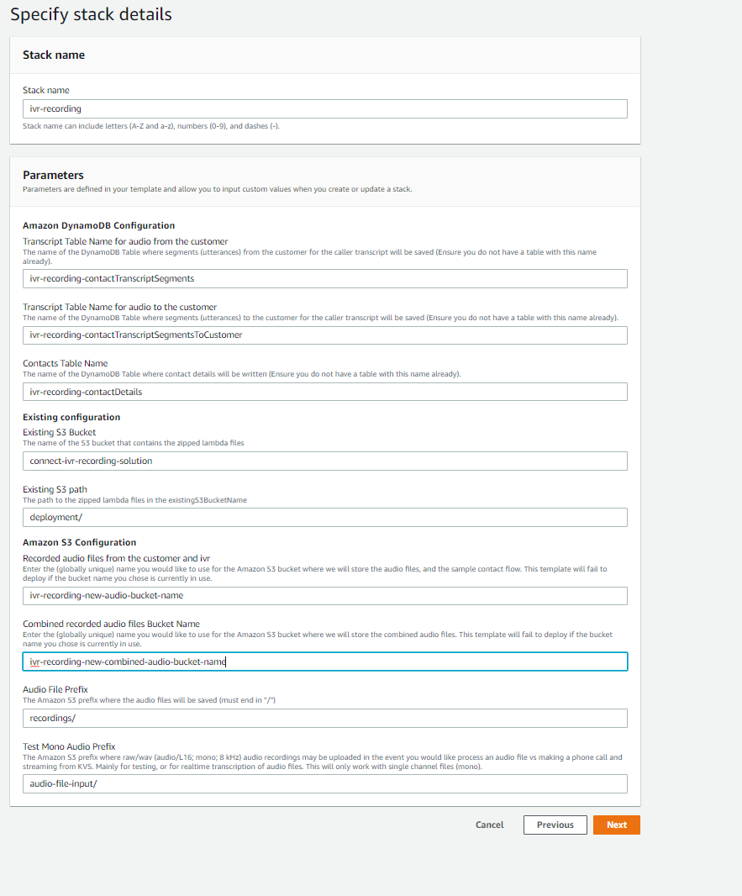
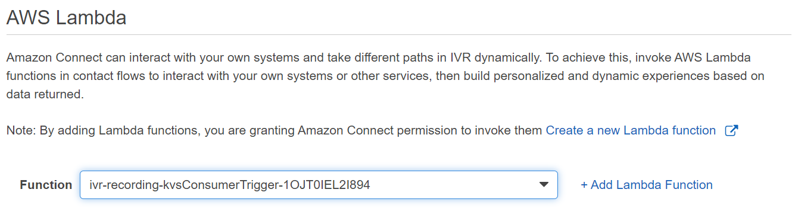
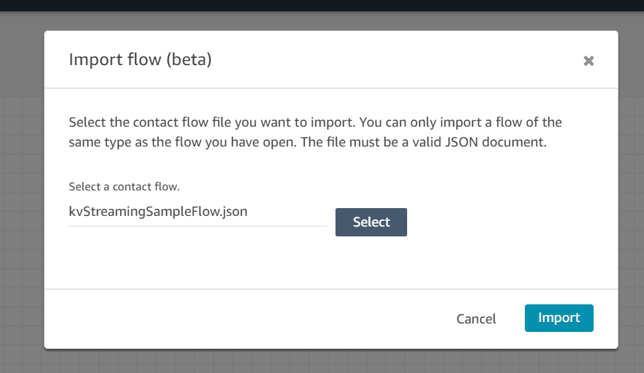
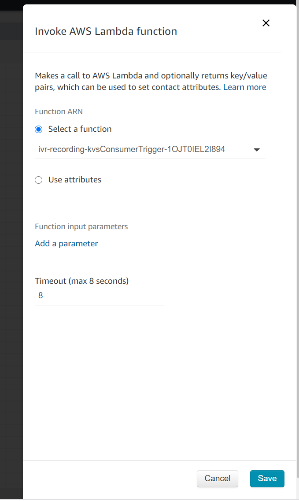
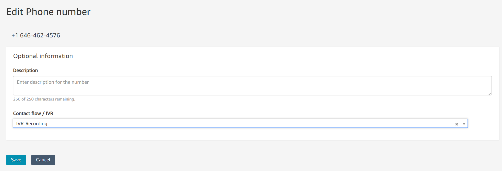

# Amazon Connect IVR Recording

Making it easy to get started with Amazon Connect live audio streaming and real-time transcription using Amazon Transcribe.

## On this Page
- [Project Overview](#project-overview)
- [Architecture Overview](#architecture-overview)
- [Getting Started](#getting-started)
- [Project Variations](#project-variations)

## Project Overview
The purpose of this project is to provide an example solution to get you started with capturing and transcribing Amazon Connect audio using Kinesis Video Streams and Amazon Transcribe. The example Lambda functions can be used to create varying solutions such as capturing audio in the IVR and transcribing customer audio. To enable these different use-cases there are multiple [environment variables](#lambda-environment-variables) environment variables and parameters in the [invocation event](#lambda-invocation-event-details) that control the behavior of the Lambda Function.

## Architecture Overview


### Description
This solution can be configured to use the following services: [Amazon Connect](https://aws.amazon.com/connect/), [Amazon Kinesis Video Streams](https://aws.amazon.com/kinesis/video-streams), [Amazon Transcribe](https://aws.amazon.com/transcribe), [Amazon DynamoDB](https://aws.amazon.com/dynamodb), [AWS Lambda](https://aws.amazon.com/lambda), and [Amazon S3](https://aws.amazon.com/s3).

With [Amazon Connect](https://aws.amazon.com/connect/), customer audio can be live streamed to Kinesis Video Streams as described in this [Amazon Connect documentation](https://docs.aws.amazon.com/connect/latest/userguide/customer-voice-streams.html). This project serves as an example of how to consume an Amazon Connect live audio stream, capture the audio from each channel of the Connect audio stream, send it to S3, and combine the audio into a single file, as well as perform real-time transcription using [Amazon Transcribe](https://aws.amazon.com/transcribe) and posting those transcriptions to a DynamoDB table. 

In the diagram above, once a call is connected to Amazon Connect:
- (Step 1) In the Amazon Connect Contact Flow, ensure there is a "Start Media Streaming" block. Based on the block settings you can stream audio from the customer, to the customer, or both.
    - (Step 1a) Once the "Start Media Streaming" block is executed, a KVS stream will be "assigned" and Amazon Connect will begin to stream the customer audio
    - Amazon Connect will continue to stream the customer audio for the duration of this call until a "Stop media streaming" block is executed, or the call is disconnected
- (Step 2) In the Amazon Connect Contact Flow invoke the [Trigger Lambda Function](#Sample-trigger-Lambda-function) which will automatically be passed the KVS details and the ContactId
    - tip: Set these Contact Attributes prior to invoking the trigger lambda function:
        - key: `transcribeCall`, value: `true` or `false`
        - key: `saveCallRecording`, value: `true` or `false`
        - key: `languageCode`, value: `en-US` or `es-US`
        - key: `streamAudioFromCustomer`, value `true` or `false`
        - key: `streamAudioToCustomer`, value `true` or `false`
- (Step 3) Amazon Connect Contact Flow invokes the kvsConsumerTrigger function with all the Contact Attributes set in the previous step.
- (Step 4) The kvsConsumerTrigger function will write the ContactID, CustomerPhoneNumber, Date, and Time to the DynamoDB table ContactDetails
- (Step 5) The kvsConsumerTrigger invokes the kvsTranscriber function passing it all the attributes needed to start consuming the Kinesis Video Stream (call audio). The Contact Flow will continue to execute while the kvsTranscriber Lambda function processes the audio stream. The function will process audio for up to 15 minutes (Lambda limit) or until the call is disconnected.
- (Step 6) The kvsTranscriber function will send the audio to Amazon Transcribe to transcribe the audio from speech to text. The Kinesis Video Stream has two channels one for Audio to Customer and one for Audio from Customer. Each audio channel is transcribed separately.
- (Step 7) The kvsTranscriber function will write the transcribed text to two different DynamoDB tables one for audio from customer, transcriptSegments, and one for audio to customer, transcriptSegmentsToCustomer.
- (Step 8) The kvsTranscriber function writes two audio files AUDIO_FROM_CUSTOMER.wav and AUDIO_TO_CUSTOMER.wav to the designated S3 bucket in the CloudFormation template with ContactID, date and time prepended to the filenames.
- (Step 9) The S3 bucket has a trigger that looks for files to be written with a .wav extension and invokes the Lambda processContactSummary
- (Step 10) The processContactSummary queries the contactTranscriptSegments tables to retrieve the transcript.
- (Step 11) The processContactSummary then updates the contactDetails table with the Contacts Transcripts using the ContactID as the Key.
- (Step 12) The processContactSummary invokes the overlay-audio Lambda that takes the two audio file names, FROM_CUSTOMER and TO_CUSTOMER, and combines them.
- (Step 13)	The processContactSummary writes the combined audio file to the combined audio S3 bucket.

The Lambda code expects the Kinesis Video Stream details provided by the Amazon Connect Contact Flow as well as the Amazon Connect Contact Id. The handler function of the Lambda is present in `KVSTranscribeStreamingLambda.java` and it uses the GetMedia API of Kinesis Video Stream to fetch the InputStream of the customer audio call. The InputStream is processed using the AWS Kinesis Video Streams provided Parser Library. If the `transcriptionEnabled` property is set to true on the input, a TranscribeStreamingRetryClient client is used to send audio bytes of the audio call to Transcribe. As the transcript segments are being returned, they are saved in a DynamoDB table having ContactId as the Partition key and StartTime of the segment as the Sort key. The audio bytes are also saved in a file along with this and at the end of the audio call, if the `saveCallRecording` property is set to true on the input, the WAV audio file is uploaded to S3 in the provided `RECORDINGS_BUCKET_NAME` bucket.

See the Amazon Transcribe [streaming documentation](https://docs.aws.amazon.com/transcribe/latest/dg/streaming.html) for the latest supported languages.

## Getting Started
Getting started with this project is easy. The most basic use case of capturing audio in the Amazon Connect IVR can be accomplished by downloading the pre-packaged Lambda Functions, deploying the CloudFormation template in your account, and importing the Contact Flows into your Amazon Connect Instance. 

### Easy Setup
- Clone the github repo into your account.
- Create an S3 bucket and create a new folder “deployment” and upload the deployment/ folder into it
    - Open the `cloudformation.template` file and copy the S3 url on it's detail page
- Go to CloudFormation and select 'Create Stack'.
    - Create the stack from an S3 url and paste the url from the cloudformation.template file
    - Fill in the parameters for the stack. The existingS3BucketName and existingS3Path should be the ones created above that contain all the deployment related code.

- While the stack is building, go to the Amazon Connect AWS console and ensure that your Amazon Connect instance has the "live media streaming" feature enabled by following the [Amazon Connect documentation](https://docs.aws.amazon.com/connect/latest/userguide/customer-voice-streams.html) for "Enable Live Media Streaming"
- Once the stack is complete you will need to add the Lambda function to your Connect Instance. In the AWS Console open the Amazon Connect management console, select the Instance you would like to add the IVR recording capabilities to, go to the Contact Flows menu, and then the AWS Lambda section. Find the Lambda function with `kvsConsumerTrigger` in the name in the list and select Add Lambda Function.
 
- Now go to the S3 management console, open the bucket that you created with the `deployment/` folder, and download the Contact Flow. The flow is called kvsStreamingSampleFlow.json.
- Log into your Amazon Connect instance and import the Contact Flow.
 
- In the Contact Flow edit the Lambda function that is configured in the Invoke Lambda Function block and select the name of the kvsConsumerTrigger Lambda function that was deployed by the Cloudformation template.  
 
- Click save and publish the Contact Flow
- In your Amazon Connect instance, claim a Phone Number and assign the Contact Flow you created to it and call the number. Depending on the settings in the KvsTranscriber Lambda Function, the audio will be saved in S3 and the transcriptions will be visible in DynamoDB.


### Building the KVS Transcriber project
The lambda code is designed to be built with Gradle. All requisite dependencies are captured in the `build.gradle` file. Simply use `gradle build` to build the zip that can be deployed as an AWS Lambda application. After running `gradle build`, the updated zip file can be found in the `build/distributions` folder; copy it to the `deployment` folder then follow the Easy Setup steps above. Other files in the `deployment` folder are zip archives, each containing an individual file from the `functions` folder. The `layer.zip` file is produced by the Connect Audio Utils project; see the Audio Utils section below for further info.

### Lambda Environment Variables
This Lambda Function has environment variables that control its behavior:
* `APP_REGION` - The region for AWS DynamoDB, S3 and Kinesis Video Streams resources (ie: us-east-1)
* `TRANSCRIBE_REGION` - The region to be used for AWS Transcribe Streaming (ie: us-east-1)
* `RECORDINGS_BUCKET_NAME` - The AWS S3 bucket name where the audio files will be saved (Lambda needs to have permissions to this bucket)
* `RECORDINGS_KEY_PREFIX` - The prefix to be used for the audio file names in AWS S3
* `RECORDINGS_PUBLIC_READ_ACL` - Set to TRUE to add public read ACL on audio file stored in S3. This will allow for anyone with S3 URL to download the audio file.
* `INPUT_KEY_PREFIX` - The prefix for the AWS S3 file name provided in the Lambda request. This file is expected to be present in `RECORDINGS_BUCKET_NAME`
* `CONSOLE_LOG_TRANSCRIPT_FLAG` - Needs to be set to TRUE if the Connect call transcriptions are to be logged.
* `TABLE_CALLER_TRANSCRIPT` - The DynamoDB table name where the transcripts of the audio from the customer need to be saved (Table Partition key must be: `ContactId`, and Sort Key must be: `StartTime`)
* `TABLE_CALLER_TRANSCRIPT_TO_CUSTOMER` - The DynamoDB table name where the transcripts of the audio to the customer need to be saved (Table Partition key must be: `ContactId`, and Sort Key must be: `StartTime`)
* `SAVE_PARTIAL_TRANSCRIPTS` - Set to TRUE if partial segments need to saved in the DynamoDB table. Else, only complete segments will be persisted.
* `START_SELECTOR_TYPE` - Set to NOW to get transcribe once the agent and user are connected. Set to FRAGMENT_NUMBER to start transcribing once the 'Start Media Streaming' block is executed in your contact flow

#### Sample Lambda Environment Variables


### Lambda Invocation Event Details
This Lambda Function will need some details when invoked:
* `streamARN` - The ARN of the Kinesis Video stream that includes the customer audio, this is provided by Amazon Connect when streaming is started successfully
* `startFragmentNum` - Identifies the Kinesis Video Streams fragment in which the customer audio stream started, this is provided by Amazon Connect when streaming is started successfully
* `connectContactId` - The Amazon Connect Contact ID, this is always present in the Amazon Connect invocation event.
* `transcriptionEnabled` - An optional flag to instruct the Lambda function if transcription (using Amazon Transcribe) is to be enabled or not (options are "true" or "false")
* `saveCallRecording` - An optional flag to instruct the Lambda function to upload the saved audio to S3 (options are "true" or "false")
* `languageCode` - An optional flag to instruct the Lambda function on what language the source customer audio is in, as of this writing the options are: "en-US" or "es-US" (US-English, or US-Spanish)
* `streamAudioFromCustomer` - An optional flag to instruct the Lambda function on whether to stream audio from the customer. It is true by default (options are "true" or "false")
* `streamAudioToCustomer` - An optional flag to instruct the Lambda function on whether to stream audio to the customer. It is true by default (options are "true" or "false")

#### Sample Lambda Invocation Event
The following is a sample invocation event:

```
   { 
       "streamARN": "arn:aws:kinesisvideo:us-east-1:6137874xxxxx:stream/kvsstreams-connect-demo-6855eee9-fa47-4b84-a970-ac6dbdd30b9d/1542430xxxxxx",
       "startFragmentNum": "9134385233318150666908441974200077706515712xxxx",
       "connectContactId": "b0e14540-ca63-4205-b285-c6dde79bxxxx",
       "transcriptionEnabled": "true",
       "saveCallRecording": "true",
       "languageCode": "en-US",
       "streamAudioFromCustomer": "true",
       "streamAudioToCustomer": "true"
    }
```
## Audio Utils
This solution uses the Connect Audio Utils project for combining audio files. For details on the building Connect Audio Utils see this link. 
[Amazon Connect Audio Utils](https://github.com/amazon-connect/amazon-connect-audio-utils)
## License Summary
This sample code is made available under a modified MIT license. See the LICENSE file.

